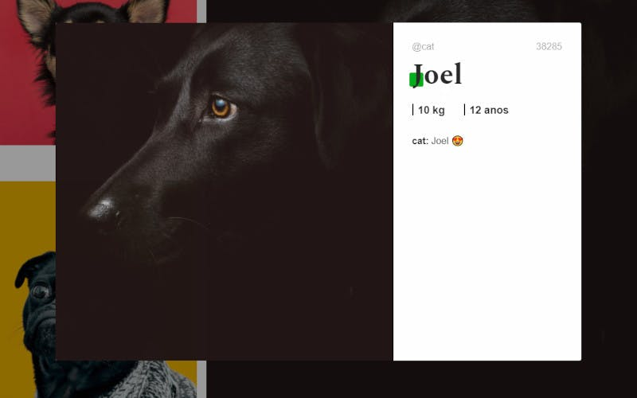

<h1 align="center">
    
</h1>

<p align="center">
  <a href="#-technologies">Technologies</a>&nbsp;&nbsp;&nbsp;|&nbsp;&nbsp;&nbsp;
  <a href="#-preview">Preview</a>&nbsp;&nbsp;&nbsp;|&nbsp;&nbsp;&nbsp;
  <a href="#-Getting-started">Getting started</a>&nbsp;&nbsp;&nbsp;|&nbsp;&nbsp;&nbsp;
  <a href="#-project">Project</a>&nbsp;&nbsp;&nbsp;|&nbsp;&nbsp;&nbsp;
</p>

## 🧪 Technologies

This project was developed using the following technologies:

- [React](https://reactjs.org/)
- [CSS](https://www.w3.org/Style/CSS/Overview.en.html)

## 🔥 Preview

[](https://facedog.rcarrenho.com.br/)

## 🚀 Getting started

Clone the project and access the folder

```bash
$ git clone https://github.com/rafacarrenho/Facedog && cd Facedog
```

Follow the steps below

```bash
# Install the dependencies
$ npm install

# Start the project
$ npm start

```

Or with Yarn

```bash
# Install the dependencies
$ yarn install

# Start the project
$ yarn start

```

## 💻 Project

[Facedog](https://facedog.rcarrenho.com.br/) was developed to validate knowledge in React.

---

<p align="center">Made with 💜 by Rafael Carrenho</p>
